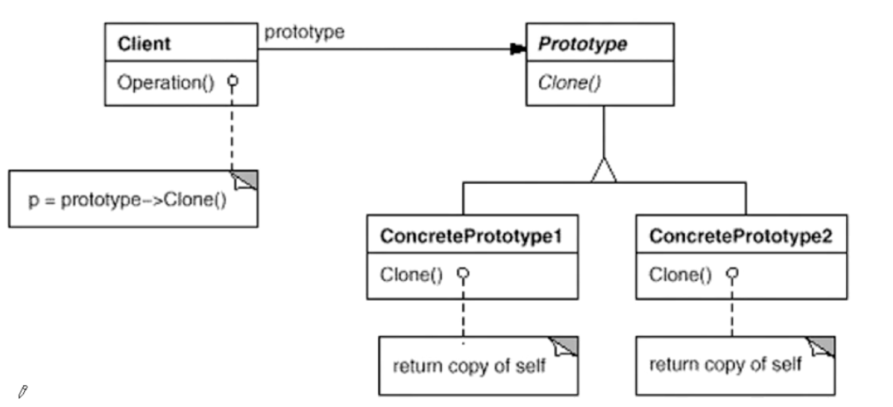
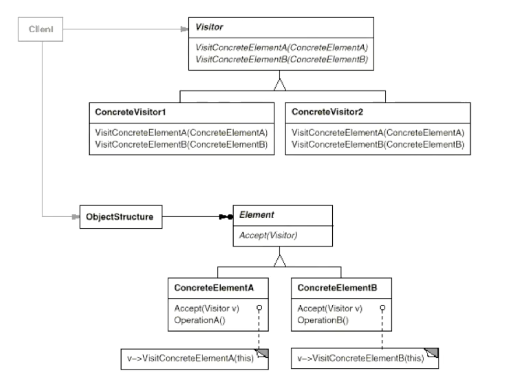

| 章节               | 分类                                                                                                    |
|:-----------------| :-------------------------------------------------------------------------------------------------------- | 
| [设计原则](#设计原则)    |                     |
| [关键思想](#关键思想)    |          |
| [代码说明](#代码说明)    |  |
| 1️⃣[组件协作](#组件协作) | Template Method模式｜Strategy 策略模式｜Observer 观察者模式|
| 2️⃣[单一职责](#单一职责) | Decorator 装饰模式｜Bridge 桥模式|
| 3️⃣[对象创建](#对象创建) | Factory 工厂模式｜Abstract Factory｜Prototype 原型模式｜Builder模式｜Singleton 单例模式｜Flyweight 享元模式|
| 4️⃣[接口隔离](#接口隔离) | Facade 门面模式｜Proxy 代理模式｜Adapter 适配器模式｜Mediator 中介者模式|
| 5️⃣[状态变化](#状态变化) | State 状态模式｜Memento 备忘录模式|
| 6️⃣[数据结构](#数据结构) | Composite 组合模式｜Iterator 迭代器模式｜Chain of Responsibility 职责链模式|
| 7️⃣[行为变化](#行为变化) | Command 命令模式｜Visitor 访问者模式|
| 8️⃣[领域规则](#领域规则) | Interpreter 解释器模式|

# 设计原则

## 依赖倒置原则（DIP）

- 高层模块（稳定）不应依赖底层模块（变化），二者都应依赖于抽象（稳定）
- 抽象不应依赖于实现细节，实现细节（变化）应依赖于抽象（稳定）

## 开放封闭原则（OCP）

- 对扩展开放，对更改封闭
- 类模版应该是可扩展的，但不可修改的

## 单一职责原则（SRP）

- 一个类应仅有一个引起它变化的原因
- 变化的方向隐含着类的责任

## Liskov替换原则（LSP）

子类必须能够替换它们的基类（IS-A）

继承表达类型抽象

## 接口隔离原则（ISP）

- 不应该强迫客户端继承它们不需要的方法
- 接口应小而完备

## 优先使用对象组合，而非类继承

- 类继承通常称为“白箱复用”，对象组合通常称为“黑箱复用”
- 继承某种程度上破坏了封装性，父类和子类耦合度过高
- 对象组合则只要求被组合的对象具有良好定义的接口，耦合度低

## 封装变化点

使用封装来创建对象的分界层，让设计者可以在分界层的一侧进行修改，而不会对另一侧产生不良的影响，从而实现层次间的松耦合

## 针对接口编程，而非针对实现编程

- 不将变量类型声明为某个特定的类，而是声明为某个接口
- 客户程序不需要获知对象的具体类型，只需要知道对象所有具有的接口
- 减少系统各部分之间的依赖关系，实现“高内聚，低耦合”的类型设计方案

# 关键思想

- 静态 -> 动态
- 早绑定 -> 晚绑定
- 继承 -> 组合
- 编译时依赖 -> 运行时依赖
- 紧耦合 -> 松耦合

# 代码说明

其中每种设计模式代码单独存放一个目录，其中的sample.cpp是常规实现，为了理解对比设计模式的优点及适用场景

# 组件协作

“框架与应用程序的划分"：组件协作”模式通过晚期绑定来实现框架与应用程序之间的松耦合，是二者之间协作时常用的模式。

## TemplateMethod模式

定义：定义一个操作的算法的骨架（稳定），而将某些步骤延迟（变化）到子类中。Template Method使得子类可以不改变（复用）算法的结构，即可重定义（重写）某些特定的步骤。

**应用场景：**在软件构建过程中，对于某一项任务，它常常有**稳定的整体操作结构**，但**各个子步骤却有很多改变的需求**，或者由于固有的原因 (比如框架与应用之间的关系)而无法和任务的整体结构同时实现。

除了可以灵活应对子步骤的变化外，“不要调用我，让我来调用 你”的反向控制结构是Template Method的典型应用。

## Strategy 策略模式

定义一系列算法，把它们一个个封装起来，并且使它们可以互相替换（变化）。该模式使得算法可独立于使用它的客户程序（稳定）而变化（扩展，子类化）。

客户程序（稳定）

**应用场景：** 在软件构建过程中，某些对象使用的算法可能多种多样，经常改变，如果将这些算法都编码到对象中，将会使对象变得异常复杂；而且有时候支持不使用的算法也是一个性能负担。

**总结：**

- Strategy及其子类为组件提供了一系列可重用的算法，从而可以使得类型在运行时方便地根据需要在各个算法之间进行切换。
- Strategy模式提供了用条件判断语句以外的另一种选择，消除条件 判断语句，就是在解耦合。含有许多条件判断语句的代码通常都需 要Strategy模式。

## Observer 观察者模式

**定义对象间的一种一对多的依赖关系，以便当一个对象的状态发生变化时，所以依赖于它的对象都能得到通知并自动更新。**

- 使用面向对象的抽象，Observer模式使得我们可以独立改变目标对象和观察者，使得两者的依赖关系达到松耦合
- 目标发送通知时，无需指定观察者，通知可以自动传播
- 观察者自己决定是否订阅通知，而目标对象对此一无所知
- MVC

**适用场景：** 需要为某些对象建立一种“通知依赖关系”  —— 一个对象(目标对象)的状态发生改变，所有的依赖对象(观察者对象)都将得到通知

# 单一职责

在软件组件的设计中，如果责任划分的不清晰，使用继承得到的结果往往是随着需求的变化，子类急剧膨胀，同时充斥着重复代码，这时候的关键是划清责任。

## Decorator 装饰模式

动态（组合形式）给一个对象增加额外的职责。就增加功能而言，Decorator模式相比生成子类（继承形式）更为灵活。（消除重复代码和减少子类个数）

**解决场景：** 过度地使用继承来扩展对象的功能”， 由于继承为类型引入的静态特质，使得这种扩展方式缺乏灵活性；并且随着子类的增多(扩展功能的增多)，各种子类的组合(扩展功能的组合)会导致更多子类的膨胀。如下图所示例子（Stream对应Component，Concrete ComponentA-C对应File/Network/Memory Stream）：

继承形式：

组合形式：

- 通过采用组合而非继承的方式，Decorator模式实现了在运行时动态扩展对象功能，而且可以根据需要扩展多个功能。避免了使用继承带来的“灵活性差”和“多子类衍生继承”
- Decorator类在接口上表现为is-a Component，但在实现上又表现为has-a Component
- Decorator模式应用的要点在于“主体类在多个方向上的扩展功能”，而非解决“多子类衍生的继承问题”

## Bridge 桥模式

将抽象部分与实现部分分离，使它们可以独立的变化。

- Bridge模式使用“对象间的组合关系”解耦了抽象与实现的绑定关系，使得抽象与实现可以沿着各自的维度来变化，即“子类化”
- 多继承方案往往违背单一职责原则(即一个类只有一个变化的原因)，复用性比较差。 Bridge模式是比多继承方案更好的解决方法
- Bridge模式一般应用在“两个非常强的变化维度”，有时一个类有多于两个的变化维度，此时就适用于Bridge模式，如上图，抽象和实现部分也可以有多个变化。

# 对象创建

通过“对象创建”模式绕开new，来避免对象创建( new )过程中所导致的紧耦合( 依赖具体类)，从而支持对象创建的稳定。它是接口抽象之后的第一步工作。

## Factory 工厂模式

定义一个用于创建对象的接口，将子类决定实例化哪一个类。Factory Method使得一个类的实例化延迟（目的：解耦，手段：虚函数）到子类。

- 工厂模式用于隔离类对象使用者和具体类型之间的耦合关系
- 工厂模式通过面对对象的方法，将所要创建的具体对象工作延迟到子类，从而实现一种扩展的策略（而非更改）
- 解决“单个对象”的需求变化。缺点在于要求创建方法/参数相同

**应用场景：**创建对象的工作由于需求的变化， 需要创建的对象的具体类型经常变化。提供一 种“封装机制”来避免客户程序和这种“具体对象创建工作“的紧耦合。

## Abstract Factory

提供一个接口，负责创建一系列“相关或者相互依赖的对象”，而无需指定它们的具体类。

- “多系列对象构建”：特定某一系列下的对象之间有相互依赖。不同系列之间的对象不能有依赖；
- 主要在于应对”新系列“的需求变动，而难以应对“新对象”的需求变动。

**应用场景：** 一系列相互依赖的对象”的创建工作由于需求的变化，往往存在更多系列对象的创建工作。提供一 种“封装机制”来避免客户程序和这种“多系列具体对象创建工作” 的紧耦合。

**与工厂模式的创建单一对象不同，抽象工厂模式是应对“一系列对象”的创建。**

## Prototype 原型模式

使用原型实例指定创建对象的种类，然后通过拷贝这些原型来创建新的对象。

- 原型模式用于隔离类对象使用者和具体类型（易变类）之间的耦合关系，它同样要求这些“易变类”拥有“稳定的接口”；
- 可以非常灵活地创建“拥有某些稳定接口”的新对象：所需工作仅仅是注册一个新类的对象（即原型），然后在任务需要的地方clone（原型克隆）
- clone方法需要实现深拷贝
- **与工厂模式的主要区别：工厂模式是通过new来创建对象，而原型模式是clone拷贝构造，可以复制原型的状态，适合于对象初始化成本较高。**

## Builder模式

将一个复杂对象的构建和其表示相分离，使得同样的构建过程（稳定）可以创建不同的表示（变化）

- Builder模式主要用于“分步骤构建一个复杂的对象”。其中“分步骤”是一个稳定的算法，而复杂对象的各个部分(步骤)则经常变化；
- Builder模式主要应对“复杂对象的各个部分”的频繁需求变动，而难以应对“分步骤”的需求变动。

**应用场景：** 面临着“一个复杂对象”的创建工作，其通常由各个部分的子对象用一定的算法构成;由于需求的变化，这个复杂对象的各个部分经常面临着剧烈的变化，但是将它们组合在 一起的算法却相对稳定。

## Singleton 单例模式

保证一个类仅有一个实例，并提供一个该实例的全局访问点。

- 构造器可以设置为protected，允许子类派生；
- 不要实现拷贝构造函数和Clone接口，这样会导致有多个实例；
- 多线程安全问题。

**应用场景：** 存在这样一些特殊的类，必须保证他们在系统只存在一个实例，才能确保他们的逻辑正确性和效率。

## Flyweight 享元模式

运用共享技术有效地支持大量的细力度对象。

采用对象共享的方法来降低系统中对象的个数，从而降低细粒度对象给系统带来的内存压力。比如**线程池、内存池**等。

# 接口隔离

在组件构建过程中，某些接口之间的依赖常常会带来许多问题、甚至根本无法实现。采用添加一层间接接口，来隔离本来互相紧密关联的接口是一种常见的解决方案。

## Facade 门面模式

为子系统中的一组接口提供一个一致（稳定）的界面，Facade模式定义一个高层接口，这个接口使得子系统更加容易使用（复用）

- 从客户程序的角度来看，Facade模式简化了整个组建系统的接口。对于组件内部和客户程序来说，达到了一种“解耦”的效果。组件内部的变化不会影响到Facade接口的变化。
- 更注重从架构的层面去看整个系统，而非单个类；
- 并非一个集装箱，任意放进去多个对象。Facade模式中组件的内部应该是“耦合关系比较大的一系列组件”，而非一个简单的集成功能。

**应用场景：** 组件的客户和组件中的子系统有了过多耦合，门面模式可以将客户程序的演化和内部子系统的变化之间的依赖进行解耦。

## Proxy 代理模式

为其他对象提供一种代理以控制（隔离，使用接口）对这个对象的对象。

- 在面向对象系统中，有时直接使用某些对象会带来很多问题，作为间接层的Proxy对象便是解决这一问题的常用手段；
- 具体实现方法和实现粒度相差很大，有些对单个对象做细微的控制，如copy-on-write。有些可能对组件模块做提供抽象代理层，在架构层次对对象做proxy；
- 并不一定要求保持接口完整的一致性。只要能够实现间接控制，有时损失一些透明性是可以接受的。

**应用场景：** 有些对象某种原因（比如对象创建的开销很大，或者某些操作系统需要安全控制，或者需要进程外的访问等），直接访问对象会带来很多麻烦，甚至根本无法直接访问，增加一层间接层（Proxy）可以不失去透明操作对象的同时来管理/控制这些对象特有的复杂性。**比如grpc的客户端**，只能通过rpc来获取服务端的对象。

## Adapter 适配器模式

将一个类的接口转换成客户希望的另一个接口。Adapter使得那些原本由于接口不兼容而不能一起工作的类可以一起工作。

- Adapter模式主要应用于“复现一些现存的类，但接口又与复用要求不一致”，在遗留代码复用、类库迁移的场景十分有用；
- GoF23定义了两种Adapter模式的实现结构：对象适配器和类适配器。类适配器使用多继承的方式，不推荐使用。对象适配器使用对象组合的方式，符合松耦合；
- 实现非常灵活，不必拘泥以上两种实现结构，如直接将“现存类对象”作为新接口的参数方法，来达到适配的目的。

**应用场景：** 在软件系统中，由于应用环境的变化，需要将“一些现存的对象”放在新的环境中应用，但是新环境要求的接口是这些现存对象所不满足的。适配器模式既能利用现有对象的良好实现，同时又能满足新的应用环境所要求的接口。

## Mediator 中介者模式

用一个中介对象来封装一系列的对象交互。中介者使得对象之间不需要显示的相互引用（编译时依赖->运行时依赖），从而使得其耦合松散，可以独立得改变它们之间的交互。

- 将多个对象之间的复杂依赖关系解耦，Mediator模式将多个对象间的控制逻辑集中管理，将“多个对象的互相关联”变为“多个对象和一个中介者关联”，简化了系统的维度，抵御了可能的变化；
- Facade模式是解耦系统间（单向）的对象关联关系，而Mediator模式是解耦系统内部各个对象之间（双向）的关联关系。

**应用场景：** 在软件构建过程中，多个对象互相关联交互的情况对象之间常常会维持一种复杂的引用关系，如果遇到一些需求的更改，这种直接的引用关系将面临不断的变化。在这种情况下，可以使用一个“中介对象”来管理对象间的关联关系，避免相互交互的对象之间的紧耦合引用关系，从而更好地抵御变化。

# 状态变化

在组件构建过程中，某些对象的状态经常面临变化，如何对这些变化进行有效的管理，同时又维持高层模块的稳定？

## State 状态模式

允许一个对象在其内部状态改变时改变它的行为，从而使对象看起来似乎修改了其行为。

- State模式将所有与一个特定相关状态的行为都放入一个State的子类对象中，在对象状态切换时，切换相应的对象；但同时维持State接口，这样实现了具体操作和状态转换之间的解耦；
- 为不同的状态引入不同的对象使得状态转换变得更加明确；
- State对象如果没有实例变量，可以使用单例模式，各个上下文共享。

**应用场景：** 某些对象的状态如果改变，其行为也会随之而发生变化，比如文档处于只读状态，其支持的行为和读写状态支持的行为就可能完全不同。状态模式可以在运行时根据对象的状态来透明地更改对象的行为，而不会为对象操作和状态转化之间引入紧耦合。

## Memento 备忘录模式

在不破坏封装性的前提下，捕获一个对象的内部状态，并在对象之外保存这个状态。这样以后就可以将对象恢复到原先保存的状态。

- Memento存储Originator对象的内部状态，在需要时恢复Originator状态；
- Memento模式的核心是信息隐藏，即Originator需要对外界隐藏信息，保持其封装性，但同时又需要将其状态保存到外界（Memento）；
- 现在一般使用效率较高、容易正确实现的序列化方案来实现Memento模式。

**应用场景：** 某些对象的状态在转换过程中，可能由于某种需要，要求程序能够回溯到对象之前处于某个点时的状态。如果使用一些公有接口来让其他对象得到对象的状态，便会暴露对象的细节实现。备忘录模式可以实现对象状态的良好保存与恢复，但同时又不会因此而破坏对象本身的封装性。

# 数据结构

一些组件内部有特定的数据结构，如果让客户程序依赖这些数据结构，将极大的破坏组件的复用性。这时候，将这些特定的数据结构封装在内部，对外提供统一的接口，来实现与特定数据结构无关的访问。

（解耦客户程序和组件内特定的数据结构）

## Composite 组合模式

将对象组合成树形结构以表示“部分-整体”的层次结构。**Composite使得用户对单个对象和组合对象的使用具有一致性。**

- Composite模式采用树结构来实现普遍存在的对象容器，从而将“一对多”的关系转化为“一对一”的关系，使得客户可以一致得（复用）处理对象和对象容器，无需关心处理的是单个对象，还是组合的对象容器；
- 将客户代码与复杂的对象容器解耦是Composite模式的核心思想，解耦之后，客户代码单纯与纯粹的抽象接口，而非对象容器的内部结构，发生依赖，从而更能“应对变化”；
- Composite模式在具体实现中，可以让父对象中的子对象进行反向追溯。

**应用场景：**客户代码过多地依赖于对象容器复杂的内部实现结构，对象容器内部实现结构(而非抽象接口)的变化将起客户代码的频繁变化，带来了代码的维护性、扩展性等弊端。组合模式将“客户代码与复杂的对象容器结构”解耦，让对象容器自己来实现自身的复杂结构，从而使得客户代码就像处理简单对象样来处理复杂的对象容器。

## Iterator 迭代器模式

提供一种方法顺序访问聚合对象中的各个元素，而又不暴露该对象的内部表示。

- 抽象：访问一个聚合对象的内容而无需暴露它的内部表示
- 多态：为遍历不同的集合结构提供一个统一的接口，从而支持同样的算法在不同的集合结构上进行操作。
- 健壮性：遍历的同时更改迭代器所在的集合结构会导致问题。

**C++标准库中的迭代器是基于模板实现，能够实现编译时多态，比面向对象的运行时多态性能更好，因此在C++中并不推荐迭代器模式。**

## Chain of Responsibility 职责链模式

使多个对象都有机会处理请求，从而避免请求的发送者和接收者之间的耦合关系。将这些对象连城一条链，并沿着这条链传递请求，直到有一个对象处理它为止。

- **应用场合在于“一个请求可能有多个接收者，但最后真正的接收者只有一个”，职责链的目的就是将二者解耦，从而更好的应对变化**；
- 应用了职责链之后，对象的职责分派将更具灵活性。我们可以在运行时动态添加或者修改请求的处理职责；
- 如果请求传递到职责链的末尾仍得不到处理，应该有一个合理的缺省机制，这是每一个接收者的责任，而不是发送者的责任。

**应用场景：** 一个请求可能被多个对象处理，但是每个请求在运行时只能有一个接受者，如果显式指定，将必不可少地带来请求发送者与接受者的紧耦合。**职责链模式可以使请求的发送者不需要指定具体的接受者，让请求的接受者自己在运行时决定来处理请求，从而使两者解耦。**

# 行为变化

在组件的构建过程中，组件行为的变化经常导致组件本身剧烈的变化。“行为变化”模式将组件的行为和组件本身进行解耦，从而支持组件行为的变化，实现两者之间的松耦合。

## Command 命令模式

将一个请求（行为）封装为一个对象，从而使你可用不同的请求对客户进行参数化。对请求排队或者记录请求日志，以及支持可撤销的操作。

（**Invoker作为调用者，请求执行某个Command，然后Command传递到Receiver，即真正执行命令的对象**）

- Command模式的根本目的在于将“行为请求者”和“行为实现者”解耦，在面向对象语言中，常见的实现手段是将“行为抽象为对象”；
- 实现Command接口的具体命令对象有时候根据需要会保存一些额外的状态信息（成员变量）。**结合Composite模式可以将多个命令封装为一个复合命令；**
- Command模式与C++的函数对象有些类似。Command以面向对象中的“接口-实现”来定义规范，更严格，但有性能损失；C++函数对象（配合模板）以函数签名来定义规范，更灵活，性能更高。

**应用场景：**“行为请求者”与“行为实现者”通常呈现一种“紧耦合”。但在某些场合比如需要对行为进行“记录、撤销/重做(undo/redo)、事务”等处理，这种无法抵御变化的紧耦合是不合适的。命令模式可以将“行为请求者”与“行为实现者解耦，将一组行为抽象为对象，可以实现二者之间的松耦合。

## Visitor 访问者模式

表示作用于某对象结构中的各元素的操作。使得可以在不改变各元素的类的前提下，定义作用于这些元素的新操作。

- Visitor模式通过双重分发（double dispatch）来实现在不更改Element层次结构的前提下，在运行时透明得为层次结构上的各个类动态添加新的操作；
- 所谓双重分发即VIsitor模式中间包含了两次动态分发（多态机制）：第一次为accept方法的多态辨析，第二次为visitElementX方法的多态；
- 最大的缺点在于扩展类的层次结构（增加新的子类），会导致Visitor类的改动。**Visitor模式适用于Element类层次结构稳定，而其中的操作却经常面临改动。**

应用场景：由于需求的改变，某些类层次结构中常常需要增加新的行为(方法 )，如果直接在基类中做这样的更改，将会给子类带来很繁重的变更负担。访问者模式可以在不更改类层次结构的前提下在运行时根据需要透明地为类层次结构上的各个类动态添加新的操作。
# 领域规则

在特定领域中，某些变化虽然频繁，但可以抽象为某种规则。这时候，结合特定领域，将问题抽象为语法规则，从而给出在该领域下的一般性解决方案。

## Interpreter 解释器模式

给定一个语言，定义它的文法的一种表示，并定义一种解释器，这种解释器使用该表示来解释语言中的句子。

- Interpreter模式的应用场合是Interpreter模式应用中的难点，只有满足"业务规则频繁变化，且类似的结构不断重复出现，并且易抽象为语法规则的问题”才适合使用Interpreter模式；
- 使用Interpreter模式来表示文法规则，从而可以使用面向对象技巧来方便地"扩展”文法。
- 如SQL语法解析

